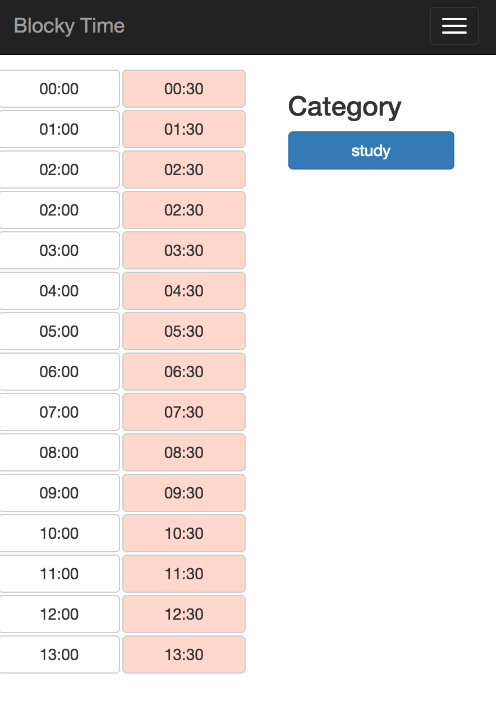

# BlockyTime

a little side project by Flask(?) and bootstrap

idea from: [BlockyTime - anniapp](http://www.anniapp.com/blockytime/index.html)

---


##requirement

build a easy-using time tracking web application

1. We can switch the date of recording
2. Everyday was divided to \\(24*2=48\\) blocks, 30mins for each
3. Intially, every block was filled by "Sleeping time"
4. Users can choose every block, multiple choosing was supported too.
5. no drag function in first version
6. We can added category to blocky time
7. Everyday's data will be saved on server


##UI


### first version

*main page*




---

## TODO list

1. [ ]front end part
	* [x] main page
2. [ ]back end
	* [ ] data base designing
	* [ ] API designing (use REST API?)
	* [ ] programming
		* [x]set up flask server
		* [ ]data base model
		* [ ]programming REST API
		* [ ]control


##Devoloper notes:

## 12.16

- specifying the requiremnt 
- initialized git repo
- Copied a templated from bootstrap


##12.23

Goal:

finish the main UI: select time, set time

Note:

### Check box buttons

> Add data-toggle="button" to activate toggling on a single button

---

for button `<label>` should be contained in `<div>` , otherwise the check box will not perform correctly.

---

if I create a new column, this colum will be splited to 12 columns automatically.

for example, if I created a column `col-xs-6`, and I want to divide this to two parts, I should create two `col-xs-6` columns in that columns.

---

[let block fulfill the height](http://www.webhek.com/css-100-percent-height)

---

I cannot use padding or margin, so I used a placeholder `div` to make the main page shift down some distance.

Avoiding the collapse of mainpage and nav bar

##12.24

Happy X'mas Eve

Learned something about REST API

some useful links:


[Learn REST: A RESTful Tutorial](http://www.restapitutorial.com)

[Node.js RESTful API](http://www.runoob.com/nodejs/nodejs-restful-api.html)

[构建 RESTful Web 服务](http://www.ibm.com/developerworks/cn/education/java/j-rest/j-rest.html)


---

using MVC framework

Model: data base interacting

Controller

Viewer: rendering page,Javascript, connecting with others by REST API

---

funny thing

Vim for python settings:

[VIM and Python - a Match Made in Heaven](https://realpython.com/blog/python/vim-and-python-a-match-made-in-heaven/)

---

get function name in Python


```
import sys
def foo():
	print sys._getframe().f_code.co_name

```

---


[find css files in flask
](http://stackoverflow.com/questions/22259847/application-not-picking-up-css-file-flask-python)


