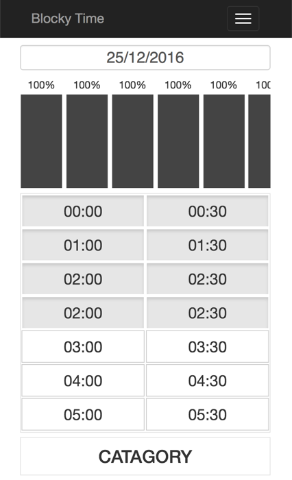

# BlockyTime

a little side project by Flask(?) and bootstrap

idea from: [BlockyTime - anniapp](http://www.anniapp.com/blockytime/index.html)

---


##requirement

build a easy-using time tracking web application

1. We can switch the date of recording
2. Everyday was divided to \\(24*2=48\\) blocks, 30mins for each
3. Intially, every block was filled by "Sleeping time"
4. Users can choose every block, multiple choosing was supported too.
5. no drag function in first version
6. We can added category to blocky time
7. Everyday's data will be saved on server


##UI

### V1.0 version




### V0.1 version


### first ui

*main page*


---

## TODO list


back-end

1. datebase issues on first running
2. support for multiple users

front-end

1. support for bad internet connection situation
2. function of add category
3. 1. UI and UX redesign


##Devoloper notes:

## 12.16

- specifying the requiremnt 
- initialized git repo
- Copied a templated from bootstrap


##12.23

Goal:

finish the main UI: select time, set time

Note:

### Check box buttons

> Add data-toggle="button" to activate toggling on a single button

---

for button `<label>` should be contained in `<div>` , otherwise the check box will not perform correctly.

---

if I create a new column, this colum will be splited to 12 columns automatically.

for example, if I created a column `col-xs-6`, and I want to divide this to two parts, I should create two `col-xs-6` columns in that columns.

---

[let block fulfill the height](http://www.webhek.com/css-100-percent-height)

---

I cannot use padding or margin, so I used a placeholder `div` to make the main page shift down some distance.

Avoiding the collapse of mainpage and nav bar

##12.24

Happy X'mas Eve

Learned something about REST API

some useful links:


[Learn REST: A RESTful Tutorial](http://www.restapitutorial.com)

[Node.js RESTful API](http://www.runoob.com/nodejs/nodejs-restful-api.html)

[构建 RESTful Web 服务](http://www.ibm.com/developerworks/cn/education/java/j-rest/j-rest.html)


---

using MVC framework

Model: data base interacting

Controller

Viewer: rendering page,Javascript, connecting with others by REST API

---

funny thing

Vim for python settings:

[VIM and Python - a Match Made in Heaven](https://realpython.com/blog/python/vim-and-python-a-match-made-in-heaven/)

---

get function name in Python


```
import sys
def foo():
	print sys._getframe().f_code.co_name

```

---


[find css files in flask
](http://stackoverflow.com/questions/22259847/application-not-picking-up-css-file-flask-python)


---

[jsonify a SQLAlchemy result set in Flask](http://stackoverflow.com/questions/7102754/jsonify-a-sqlalchemy-result-set-in-flask)

---

we should store following data:

**Primary-Category**

id|Category name | color set		| logo |
|---|------------- | -------------	|---|
0|Sport		  | red|a.png
1|study  | green|b.png

**second-Category**

id|parent_id|category name | color| logo|
|---|---|---|---|---|---|
|0|joging|origin|jog.png|


**date**

|id|date|last-changed-time|
|---|---|---|
|0|12-28-2016|01-01-2016 20:00|

**Block**

|id|date_id|show_time|position|second-category-shid|
|---|---|---|----|----|---|
0|2|12:30|12|3

##12.26

Added a datepicker:

[uxsolutions/bootstrap-datepicker](https://uxsolutions.github.io/bootstrap-datepicker/?markup=input&format=dd%2Fmm%2Fyyyy&weekStart=&startDate=&endDate=&startView=0&minViewMode=0&maxViewMode=4&todayBtn=linked&clearBtn=false&language=en&orientation=auto&multidate=&multidateSeparator=&autoclose=on&todayHighlight=on&forceParse=on#sandbox)

notes:

1. there a lot of useless files in downloaded package for my project. following is useful:
	- bootstrap-datepicker.js
	- bootstrap-datepicker.css
2. I should review the knowledge of jQuery

---

It is better not to put lots of rows in a column..

I found a margin issue, but after cutting down the number of rows from 10+ to 1. That issue has been gone.

Weird.


##12.28

Goal: create database of backend


---

I obtained some class as Singleton, such initialization and datebase model.

tutorial:

[Singleton](http://python-3-patterns-idioms-test.readthedocs.io/en/latest/Singleton.html)

---

Note:

python is a scriping language, actually, the codes on the first line will be executed first.

Totally different from C...

---


Time issue

There are some type of "Time" description in SQL

- DATE
- TIME
- DATETIME

If you set a column to "DATE", you can only write date with `datetime.date(year,mon,date)`

For "DATETIME", using `datetime.datetime(year,mon,date,hour,minus, second)`

if you want to get current time, please use `time.localtime()`

you will get a structure like this:
`time.struct_time(tm_year=2016, tm_mon=12, tm_mday=28, tm_hour=18, tm_min=22, tm_sec=7, tm_wday=2, tm_yday=363, tm_isdst=0)`


Each property of that structure is read-only. 

If you want to customize a time structure, you can use `time.strptime("2016-12-28 00:00:00", "%Y-%m-%d %H:%M:%S")`

[detailed document](http://www.runoob.com/python/python-date-time.html)


---

what is forginKey

[外键（引用）约束](http://www.ibm.com/support/knowledgecenter/zh/SSEPGG_9.5.0/com.ibm.db2.luw.admin.dbobj.doc/doc/c0020153.html)


##12.29


Goal:


finish backend programming, if possible, write api


----

[flask rest api library](http://flask-restful-cn.readthedocs.io/en/0.3.5/quickstart.html)


---

Serialize the query result to JSON

[jsonify a SQLAlchemy result set in Flask](http://stackoverflow.com/questions/7102754/jsonify-a-sqlalchemy-result-set-in-flask)


----


Little tricks

`is` = `==`

`is not` = `!=`

---

... the built-in class `datetime` can also get current time

[PYTHON-基础-时间日期处理小结](http://www.wklken.me/posts/2015/03/03/python-base-datetime.html#1-datetime_1)

remove microsecond from `datetime.datetime.now()'

```
>>> import datetime
>>> now = datetime.datetime.now()
>>> print unicode(now.replace(microsecond=0))
2011-11-03 11:19:07
```


[Python datetime to string without microsecond component](http://stackoverflow.com/questions/7999935/python-datetime-to-string-without-microsecond-component)


second answer


##12.30


kind of finished!

met a weird 405 http issue, at last find it is not the problem of CORS.

----


##01. 05

Happy new year!

Goal: To add flask manager, mutiple users


**Primary-Category**

uid|id|Category name | color set		| logo |
|----|---|------------- | -------------	|---|
|0|0|Sport		  | red|a.png
|0|1|study  | green|b.png

**second-Category**

uid|id|parent_id|category name | color| logo|
|---|---|---|---|---|---|---|
|0|0|joging|origin|jog.png|


**date**

|uid|id|date|last-changed-time|
|---|---|---|---|
|0|0|12-28-2016|01-01-2016 20:00|

**Block**

|uid|id|date_id|show_time|position|second-category-shid|
|---|---|---|---|----|----|---|
|0|0|2|12:30|12|3


**users**

| uid| nick_name| password|
|---|---|---|
|1|abc|abcdefg|


---
 
 
I can use User.query.get(id) to get an item of a table


>get(ident)
>
>Return an instance based on the given primary key identifier, or None if not found.

>E.g.:
>
>```
>
>my_user = session.query(User).get(5)

>some_object = session.query(VersionedFoo).get((5, 10))
>
>```

----

good git repo of flask app

[viprs/FlaskyBlog](https://github.com/viprs/FlaskyBlog/blob/master/manage.py)

---


##03.02

UI improvement

made a static for this application.

met some issue while trying to build a horizontal bar chart.

**how to make div blocks inline**

1. set `white-space: nowrap` and `display:inline`  in ul
2. set `display:line` for li
3. set `display: line-block` for div **important!!!**


[original article](https://segmentfault.com/a/1190000002724978)


**[hide scroll bar in webkit](https://blog.niceue.com/front-end-development/hide-scrollbar-but-still-scrollable-using-css.html)**


---

##03.03

do not use `height:80%`. the better way to set presentage height is `height:100%;max-height:80%`

---

##03.05

###refining requirements

1. multiple users
	1. User interface: login page and sign in page
	2. !!!Backend: re-organizing the database
	3. Behavior:
		1. Users can sign up for a new account
		2. Users can sign up a new account with an email
		3. Users can login to their account with email name & password
		4. Users can log out their account on setting page
		5. Users are able to change the password on setting page
		6. Users can login as a guest accout, for demo.
2. users can modify categories
	1. UI: setting page
	2. Behaviors:
		1. Users can view all categories on setting page
		2. on default, all categories are marked as "no records?" or other name
		3. Users can remove a primary category,
			1.  User will receive a warnning.
			2. if they do that, all blocks with that category turn to "no records"
		4. Users can add a new primary category.
			1. every primary category always have an item "other", which is unable to be remove
		5. Users are able to remove a second category 
			1. User will receive a warnning.
			2. after removing, there is no influence for primary categories.
			3. change all blocks with the same category name to "other"
		6. Users can add a new second category
		7. About add operation:
			1. The user must give a valid name to a category
			2. The user must assign a new color to a category
			3. *Optional*: user need to add a icon for the category
				1. Think: what design pattern should I use in case of more requirement.
		6. Users can change the sequence of all categories.
		7. Users can change the name and color of all categories.
3. data analysis and display
	1. UI: display page
	2. Behavior:
		1. Users can view the data in different charts:
			1. *Optional*:pie chart
			2. bar chart
				1. The sequence of bars will be adjusted according to the presentage.
			3. *Optional*:line chart
		2. For each type of charts, users may be able to set the scope between a day and a year
		3. As for data, at beginning, users will see the presentage of the primary category.
		4. users are able to check the detialed information of each primary category.
		5. Users are able to view the trend of a primary category
		6. *Optional*: Divide all primary categories into 3 parts: Positive, Neutural, Nagetive. View the trend of them.
4. Main page:
	1. Behavior:
		1. User will see a simple static of today's statics information
		2. User can jump to another Date to see what happened on that date.
		3. Users are only able to assign second category to a block
		4. every primary category have a default second category named "other"


###Code Structure of Backend

4 Parts

0. Global Initialization & Utilities
1. Interface to Fontend
2. Database Operation 
3. Data Controller

Calling flow:

Fontend ===query===> Interface ===> data Controller ===> Database

####Interface to Fontend 

**MAIN PAGE**

#####GET: /MainPage/uid/DATE/2017-03-05

return: 

1. UID
1. Date: 2017-03-05
2. Blocks: {Block: Primary.secondCategory, Block: Primary.secondCategory.color}
3. Statics: {Primary:Presentage}

#####POST: /MainPage/Date/2017-03-05/

parameter:

1. UID
1. Date: 2017-03-05
2. Blocks: {Block: Primary.secondCategory}

return: 

1. user information
2. new date
3. blocks


**Sign in page**

#####POST: /SIGNIN

parameter:

1. Username
2. password

return:

1. UID
1. success 
2. failed or non-exist user
3. redirect url

**Sign up Page**

#####POST: /SIGNUP

parameter:

1. username
2. password

return:

1. UID
1. success
2. failed
3. redirect url

**Statics Page**

#####GET: /StaticsPage/Day/2017-03-05?uid=UID

return:

1. UID
2. Date: 2017-03-05
3. Statics: {Primary: presentage, primary:hours}

#####GET: /StaticsPage/Month/2017-03?uid=UID

return:

1. UID
2. Month: 2017-03
3. Statics: {Primary: presentage, primary:hours}

#####GET: /StaticsPage/Year/2017?uid=UID

return:

1. UID
2. Date: 2017
3. Statics: {Primary: presentage,primary: hours}

#####GET: /StaticPage/PrimaryCategory?uid=UID&&primary_category=Primary Category

return:

1. UID
2. Primary_category {Name, second:{second:persentage, second:hours}}

**Setting Page**

#####GET: /SettingPage/account?uid=UID

return: 

1. UID
2. account name


#####POST: /SettingPage/account/changepassword

parameters

1. UID
2. old password
3. new password

return:

1. UID
2. success
3. failed

#####POST: /SettingPage/account/logout

parameter:

1. UID


return:

1. UID
2. success/failed

#####GET: /CategoriesPage

return

1. UID
2. categories: {Primary:{second:name, id....}}

>Two solutions: 
>
>1. query data on every time
>2. query the data once, and then renew the data

#####POST: /CategoriesPage

----


####Data Controller


```

class Block
{
	@properties
	int block_id,
	Date
	PrimaryCategory Primary_category_id,
	SecondCategory Second_category,
	
	@methods
	int set_second_category
}

```

```
class Date
{
	@properties
	int date_id
	string last_change_time
	Block[] blocks
	
	@method
	int generate_empty_date
	
}

```

```
class Category
{
	@properties
	int color,
	int name,
	
	@method
	int set_name
	int set_color
	int remove_this
}


```

```
class PrimaryCategory:Category
{
	@properties
	int primary_id
	SecondCategory[] second_categories
	
	@method
	int remove_this
	SecondCategory get_child_by_id()
	SecondCategory get_child_by_name()
	
	

}
```

```
class SecondCategory:Category
{
	@property
	int second_id
	PrimaryCategory primary_category
	
	@method
	int remove_this
	PrimaryCategory get_parent()
}


```

----

####Database Operation 

##3.06

Ineffective all day, used a whole afternoon to fix the issue of the sqlite cannot create database on my computer.

Finally, found it is because I have a typo on database_path

:( got very depressive today..


##3.31

met some issue about how to align an element in vertical direction.

solved with using `display: table`

HTML

```
<div id="wrapper">  
    <div id="cell">
        <div class="content">Content goes here</div>
    </div>
</div>  
```

CSS

```
#wrapper {
    display: table;
}

#cell {
    display: table-cell;
    vertical-align: middle;
}
```


	
	

